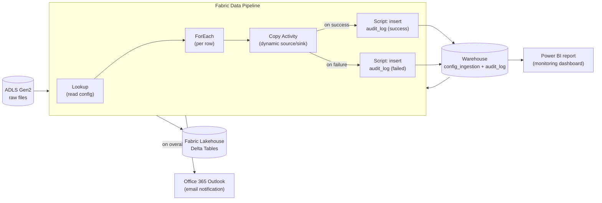

# Tutorial: Building a Simple Metadata-Driven Pipeline in Microsoft Fabric (ADLS Gen2 → Lakehouse)

> ℹ️ **Note:** This is a **simplified** version of the [official Metadata-driven Ingestion Framework](https://github.com/microsoft/fabric-samples/tree/main/community-samples/Metadata-driven%20Ingestion%20Framework) in `microsoft/fabric-samples`. It keeps the core loop — **read metadata → loop → copy → land in Lakehouse** — plus a **lightweight version of auditing, email notification, and reporting** so the pattern is useful in real day-to-day work, without dragging in multi-source connectors, schema drift, or watermark management.

---

## 1. Introduction

A **metadata-driven pipeline** is a single, generic pipeline whose behavior is steered entirely by a configuration table (the *control table*). Instead of building one pipeline per source file or table, you build one pipeline that reads a list of sources at runtime and processes them in a loop.

**Why this pattern matters**

- **Scalability** — onboarding a new source is a one-row `INSERT`, not a pipeline redesign.
- **Maintainability** — a single Copy activity to update means a single place to fix bugs.
- **No-code onboarding** — analysts and data stewards can extend the platform without touching the pipeline canvas.
- **Consistency** — every source flows through the same logging, naming, and error path.

**Architecture at a glance**



---

## 2. Prerequisites

- A **Microsoft Fabric** workspace backed by an active **Capacity** (F2 or higher works for this tutorial).
- An **Azure Data Lake Storage Gen2** account with a container.
- Workspace role: **Contributor** (or higher) so you can create Lakehouses, Warehouses, Pipelines, and Connections.
- Permission to create a **Data Connection** in Fabric. For ADLS Gen2, choose one of:
  - Account Key / SAS (testing only)
  - **Service Principal** (recommended for production)
  - Organizational Account / Workspace Identity (recommended for first-time exploration)
- An **Office 365 / Outlook** account that Fabric can authorize for sending notification emails.
- (Optional) **Power BI** authoring rights in the workspace for the reporting step.

### Sample data shipped with this tutorial

Three small CSV files are provided in the [`sample-data/`](sample-data) folder of this repo:

| File | Rows | Purpose |
|---|---|---|
| [`sample-data/customers.csv`](sample-data/customers.csv) | 10 | Customer master |
| [`sample-data/orders.csv`](sample-data/orders.csv) | 15 | Transaction fact |
| [`sample-data/products.csv`](sample-data/products.csv) | 8 | Product catalog |

Upload them to ADLS Gen2 so they land at:

```
<container>/raw/sales/customers.csv
<container>/raw/sales/orders.csv
<container>/raw/sales/products.csv
```

Quick upload with Azure CLI:

```powershell
$ACCOUNT = "<your-storage-account>"
$CONTAINER = "<your-container>"

az storage blob upload-batch `
  --account-name $ACCOUNT `
  --destination "$CONTAINER/raw/sales" `
  --source ".\sample-data" `
  --pattern "*.csv" `
  --auth-mode login
```

> 💡 **Tip:** Any small CSV/Parquet files will work — the framework is format-agnostic. The shipped files just give you a runnable baseline.

---

## 3. Architecture (Simplified)

The official framework defines six components (Control Table, Data Ingestion, Auditing, Notification, Config Management, Reporting). For this tutorial we keep all six, but in a **deliberately minimal** form:

| # | Component | Kept? | How it's simplified |
|---|---|---|---|
| 1 | Control Table | ✅ | 7-column `config_ingestion` Delta table |
| 2 | Data Ingestion (Copy) | ✅ | Single dynamic Copy activity |
| 3 | Auditing | ✅ *simple* | 8-column `audit_log` Delta table — no lineage, no `data_read`/`data_written` breakdowns |
| 4 | Notification | ✅ *simple* | One Office 365 Outlook activity on overall success/failure |
| 5 | Config Management | ⚠️ partial | Connection only, no env table |
| 6 | Reporting | ✅ *simple* | Two SQL queries + one Power BI page on `audit_log` |

```
ADLS Gen2 (raw files)
        │
        ▼
Warehouse.config_ingestion ──► Pipeline (Lookup → ForEach → Copy → Audit Script)
                                              │                            │
                                              ▼                            ▼
                                  Fabric Lakehouse (Delta Tables)   Warehouse.audit_log
                                                                           │
                                                                           ▼
                                       Email notification           Power BI report
```

> ℹ️ **Why two storage items?**
> - The **Lakehouse** receives the actual ingested data (Delta tables landed by Copy).
> - The **Warehouse** hosts the two T-SQL tables the pipeline reads from and writes to. The Lakehouse SQL analytics endpoint is **read-only**, so the Script activity's `INSERT INTO audit_log` would fail there — a Warehouse is required for writeable T-SQL.

---

## 4. Step 1 — Create the Lakehouse and Warehouse

**What:** Provision a **Lakehouse** to receive the ingested data and a **Warehouse** to host the metadata + audit tables.

**Why:** A Warehouse exposes a **read/write T-SQL** surface, which the Script activity needs in order to `INSERT` audit rows. The Lakehouse SQL endpoint is read-only and would reject those inserts.

**How:**

1. Open your Fabric workspace.
2. Select **+ New item** → **Lakehouse**. Name it `lh_ingestion_demo` and click **Create**.
   - In the explorer you will see `Tables/` (managed Delta) and `Files/` (unmanaged).
3. Select **+ New item** → **Warehouse**. Name it `wh_ingestion_demo` and click **Create**.
   - This is where `config_ingestion` and `audit_log` will live.

> ℹ️ **Note:** The Fabric UI evolves quickly. If a menu name differs, check the Microsoft Learn docs for [Lakehouse](https://learn.microsoft.com/fabric/data-engineering/lakehouse-overview) and [Warehouse](https://learn.microsoft.com/fabric/data-warehouse/data-warehousing).

---

## 5. Step 2 — Create the Metadata and Audit Tables (in the Warehouse)

**What:** Two T-SQL tables in `wh_ingestion_demo` — `config_ingestion` (drives every run) and `audit_log` (records every run).

**Why:** Treating the source list **and** the run history as data — not as pipeline JSON or log files — is what makes the framework both metadata-driven and observable. Adding a source becomes an `INSERT`; investigating last night's failure becomes a `SELECT`. They live in a **Warehouse** (not the Lakehouse) so that the pipeline's Script activity can `INSERT` audit rows — the Lakehouse SQL endpoint is read-only.

> 💡 **Run-once SQL script:** All the DDL + seed `INSERT`s are bundled in [`warehouse/create-metadata-and-audit-tables.sql`](warehouse/create-metadata-and-audit-tables.sql). In the Warehouse, click **New SQL query**, paste the script, click **Run**, and skip ahead to §6 if you don't need the walkthrough below.

### 5.1 `config_ingestion` schema

| Column | T-SQL type | Description |
|---|---|---|
| `source_id` | INT | Primary key (logical) |
| `source_system` | VARCHAR(100) | Friendly name of the source, e.g. `adls_sales` |
| `source_path` | VARCHAR(500) | Full path in ADLS Gen2 relative to the container, e.g. `raw/sales/customers.csv` |
| `file_format` | VARCHAR(20) | `csv` or `parquet` |
| `target_table` | VARCHAR(100) | Name of the Delta table in the Lakehouse |
| `load_mode` | VARCHAR(20) | `full` or `incremental` |
| `is_active` | BIT | `1` to include in the next run, `0` to skip |

### 5.2 Create and seed `config_ingestion` (T-SQL)

In the Warehouse, open **New SQL query** and run:

```sql
CREATE TABLE dbo.config_ingestion (
    source_id       INT          NOT NULL,
    source_system   VARCHAR(100) NOT NULL,
    source_path     VARCHAR(500) NOT NULL,
    file_format     VARCHAR(20)  NOT NULL,
    target_table    VARCHAR(100) NOT NULL,
    load_mode       VARCHAR(20)  NOT NULL,
    is_active       BIT          NOT NULL
);

INSERT INTO dbo.config_ingestion
    (source_id, source_system, source_path,                  file_format, target_table, load_mode, is_active)
VALUES
    (1, 'adls_sales', 'raw/sales/customers.csv', 'csv', 'customers', 'full', 1),
    (2, 'adls_sales', 'raw/sales/orders.csv',    'csv', 'orders',    'full', 1),
    (3, 'adls_sales', 'raw/sales/products.csv',  'csv', 'products',  'full', 1),
    (4, 'adls_sales', 'raw/sales/legacy.csv',    'csv', 'legacy',    'full', 0);  -- disabled on purpose
```

### 5.3 `audit_log` schema

A deliberately small audit table — just enough to answer *"what ran, when, how long, did it work, and how many rows?"*

| Column | T-SQL type | Description |
|---|---|---|
| `run_id` | VARCHAR(100) | Pipeline run ID (`@pipeline().RunId`) — groups all rows of one execution |
| `source_id` | INT | FK back to `config_ingestion.source_id` |
| `target_table` | VARCHAR(100) | Destination Delta table |
| `start_time` | DATETIME2(3) | When the per-source copy started |
| `end_time` | DATETIME2(3) | When the per-source copy ended |
| `duration_sec` | INT | `end_time - start_time` in seconds |
| `rows_copied` | BIGINT | `rowsCopied` reported by the Copy activity |
| `status` | VARCHAR(20) | `success` or `failed` |
| `error_message` | VARCHAR(4000) | Activity error text on failure, `NULL` on success |

### 5.4 Create the empty `audit_log` table

```sql
CREATE TABLE dbo.audit_log (
    run_id          VARCHAR(100)  NOT NULL,
    source_id       INT           NULL,
    target_table    VARCHAR(100)  NULL,
    start_time      DATETIME2(3)  NULL,
    end_time        DATETIME2(3)  NULL,
    duration_sec    INT           NULL,
    rows_copied     BIGINT        NULL,
    status          VARCHAR(20)   NOT NULL,
    error_message   VARCHAR(4000) NULL
);
```

> ⚠️ **Warning:** Don't run the `CREATE TABLE dbo.audit_log` a second time once the pipeline is in flight — it will fail because the table already exists. The bundled [`warehouse/create-metadata-and-audit-tables.sql`](warehouse/create-metadata-and-audit-tables.sql) wraps it in an `IF OBJECT_ID(...) IS NULL` guard so re-running the setup script is safe.

---

## 6. Step 3 — Create the ADLS Gen2 Connection

**What:** A reusable Fabric **Connection** that the Copy activity will use to reach your storage account.

**Why:** Connections decouple credentials from pipeline JSON, so the same pipeline can be repointed across environments without code changes.

**How:**

1. From the workspace, open **Manage connections and gateways** (or **Settings → Manage connections**).
2. Click **+ New** → **Cloud** → **Azure Data Lake Storage Gen2**.
3. Provide the **URL** in the form `https://<account>.dfs.core.windows.net/<container>`.
4. Choose an authentication method:

   | Method | Use when |
   |---|---|
   | **Organizational account** | Quick test with your own identity |
   | **Service Principal** | Recommended for production / shared pipelines |
   | **Account Key** | Throwaway demos only |
   | **Workspace Identity** | Best-practice managed identity option |

5. Name the connection `conn_adls_sales` and save.

> ⚠️ **Warning:** Avoid Account Keys outside of throwaway labs — they are long-lived bearer secrets.

---

## 7. Step 4 — Build the Data Pipeline

**What:** A single pipeline with five activity types: **Lookup → ForEach { Copy → Audit Script (success / failure) } → Email notification**.

**Why:** This skeleton expresses the full pattern — read config, loop, copy, log the outcome, and tell a human.

### 7.1 Create the pipeline

1. In the workspace, **+ New item** → **Data pipeline**. Name it `pl_metadata_ingest`.

### 7.2 Add the Lookup activity

1. Drag a **Lookup** activity onto the canvas. Name it `LKP_Config`.
2. **Connection type:** **Warehouse**. **Workspace:** current. **Warehouse:** `wh_ingestion_demo`.
3. Toggle **Use query** and paste:

   ```sql
   SELECT *
   FROM config_ingestion
   WHERE is_active = 1;  -- T-SQL Warehouse uses 1/0 for BIT, not true/false
   ```

4. **Important:** uncheck **First row only** so the activity returns all rows.


### 7.3 Add the ForEach activity

1. Drag a **ForEach** activity. Connect `LKP_Config` (On success) → `ForEach`.
2. Name it `FE_PerSource`.
3. In **Settings**, set **Items** to:

   ```text
   @activity('LKP_Config').output.value
   ```

4. Leave **Sequential** unchecked to allow parallel copies (Fabric will respect your capacity limits).


### 7.4 Add the Copy activity inside ForEach

1. Open the ForEach by clicking the pencil icon.
2. Drag a **Copy data** activity into it. Name it `CP_AdlsToLakehouse`.
3. **Source** tab:
   - Connection: `conn_adls_sales`
   - File path type: **File path**
   - File path: `@item().source_path`
   - File format: `@item().file_format` (or pick CSV/Parquet datasets dynamically as described in Step 5)
4. **Destination** tab:
   - Workspace: current
   - Lakehouse: `lh_ingestion_demo`
   - Root folder: **Tables**
   - Table name: `@item().target_table`
   - Table action: **Overwrite** for full loads, **Append** for incremental — see the expression in §8.


### 7.5 Add the audit Script activities (success & failure)

Still inside the ForEach, add **two Script activities** wired to `CP_AdlsToLakehouse`:

- `SCR_Audit_Success` — connected from Copy via the **green (On success)** arrow.
- `SCR_Audit_Failure` — connected from Copy via the **red (On failure)** arrow.

For both, set the connection to the **Warehouse** `wh_ingestion_demo` (the Script activity needs read/write T-SQL, which the Lakehouse SQL endpoint does not provide) and choose **Script type = Non-query**.

**`SCR_Audit_Success` script:**

```sql
INSERT INTO audit_log
(run_id, source_id, target_table, start_time, end_time,
 duration_sec, rows_copied, status, error_message)
VALUES (
  '@{pipeline().RunId}',
  @{item().source_id},
  '@{item().target_table}',
  '@{activity('CP_AdlsToLakehouse').executionStartTime}',
  '@{activity('CP_AdlsToLakehouse').executionEndTime}',
  @{activity('CP_AdlsToLakehouse').output.copyDuration},
  @{activity('CP_AdlsToLakehouse').output.rowsCopied},
  'success',
  NULL
);
```

**`SCR_Audit_Failure` script:**

```sql
INSERT INTO audit_log
(run_id, source_id, target_table, start_time, end_time,
 duration_sec, rows_copied, status, error_message)
VALUES (
  '@{pipeline().RunId}',
  @{item().source_id},
  '@{item().target_table}',
  '@{utcNow()}',
  '@{utcNow()}',
  0,
  0,
  'failed',
  '@{replace(coalesce(activity(''CP_AdlsToLakehouse'').error.message, ''unknown''), '''''''', ''"'')}'
);
```

> ⚠️ **Warning:** The single-quote escaping in the failure script is intentional — pipeline expressions use `''` to represent a literal apostrophe. Test the script once with a deliberately wrong `source_path` to confirm the failure path writes a row.

### 7.6 Add the email notification (outside the ForEach)

Back on the main canvas, drag two **Office 365 Outlook** activities after `FE_PerSource`:

- `EMAIL_Success` — connected via **green (On success)** arrow.
- `EMAIL_Failure` — connected via **red (On failure)** arrow.

For both, sign in with the account that should send the mail, then configure:

| Field | `EMAIL_Success` | `EMAIL_Failure` |
|---|---|---|
| **To** | `data-ops@yourcompany.com` | `data-ops@yourcompany.com` |
| **Subject** | `[Fabric] pl_metadata_ingest SUCCESS — @{pipeline().RunId}` | `[Fabric] pl_metadata_ingest FAILED — @{pipeline().RunId}` |
| **Body (HTML)** | see below | see below |

**Success body:**

```html
<p>Pipeline <b>pl_metadata_ingest</b> completed successfully.</p>
<ul>
  <li>Run ID: @{pipeline().RunId}</li>
  <li>Started: @{pipeline().TriggerTime}</li>
  <li>Workspace: @{pipeline().DataFactory}</li>
</ul>
<p>See the <b>Pipeline Monitoring</b> report for per-table row counts.</p>
```

**Failure body:**

```html
<p style="color:#b00020"><b>Pipeline pl_metadata_ingest FAILED.</b></p>
<ul>
  <li>Run ID: @{pipeline().RunId}</li>
  <li>Started: @{pipeline().TriggerTime}</li>
</ul>
<p>Query <code>audit_log</code> WHERE <code>run_id = '@{pipeline().RunId}'</code> for details.</p>
```


---

## 8. Step 5 — Parameterization & Dynamic Expressions

**What:** The expressions that turn one static Copy activity into a generic one.

**Why:** Every property the pipeline needs to vary per row must be bound to a `@item().<column>` expression coming from ForEach.

Common expressions used in this tutorial:

```text
# Source path coming from the control table
@item().source_path

# Pick the destination table per iteration
@item().target_table

# Map load_mode -> Copy table action
@if(equals(item().load_mode, 'full'), 'Overwrite', 'Append')

# Format-aware dataset choice (used in If Condition if you split branches)
@equals(item().file_format, 'parquet')
```

> 💡 **Tip:** When a property only accepts a string (e.g. *Table action*), wrap the expression with `@{ ... }` so Fabric evaluates it inline:
>
> ```text
> @{if(equals(item().load_mode,'full'),'overwrite','append')}
> ```

### Dynamic dataset binding (optional)

If you want a single Copy activity to handle both CSV and Parquet without an `If Condition`, configure the source as a **Binary** dataset for the file path, and let the destination Lakehouse infer the schema. For maximum control, split into two Copy activities under an **If Condition** keyed on `@equals(item().file_format,'csv')`.

---

## 9. Step 6 — Run and Validate

**What:** Trigger the pipeline manually and confirm tables land in the Lakehouse and audit rows appear.

**How:**

1. Click **Run** on the pipeline toolbar.
2. Watch the **Output** pane — `LKP_Config` should return 3 rows (the active ones), and `FE_PerSource` should iterate three times.
3. Open `lh_ingestion_demo` → **Tables/** — you should see `customers`, `orders`, and `products` as Delta tables.
4. Check your inbox for the success email.
5. Validate row counts and audit rows. The landed data lives in the Lakehouse SQL endpoint; the audit table lives in the Warehouse:

   ```sql
   -- Run in the Lakehouse SQL analytics endpoint — did the data land?
   SELECT 'customers' AS table_name, COUNT(*) AS row_count FROM customers
   UNION ALL
   SELECT 'orders',    COUNT(*) FROM orders
   UNION ALL
   SELECT 'products',  COUNT(*) FROM products;

   -- Run in the Warehouse wh_ingestion_demo — did the pipeline log the run?
   SELECT target_table, status, rows_copied, duration_sec, start_time
   FROM   audit_log
   WHERE  run_id = '<paste the run id from the pipeline monitor>'
   ORDER  BY start_time;
   ```

> ℹ️ **Note:** If a table is missing, check that its `is_active` flag is `1` and that the file path in the control table matches the actual ADLS layout. If the data landed but no audit row appeared, double-check the Script activity is connected to the **Warehouse** (not the Lakehouse SQL endpoint, which would silently fail the INSERT).

### 9.1 Force a failure to test the failure path

Temporarily flip one row's `source_path` to a non-existent file, re-run, and confirm:

- The Copy activity reports a red error.
- `SCR_Audit_Failure` runs and inserts a row with `status = 'failed'` and a non-null `error_message`.
- `EMAIL_Failure` fires (`EMAIL_Success` does not).

---

## 10. Step 7 — Add a New Source Without Touching the Pipeline

This is where the pattern earns its keep. Imagine a new `inventory.csv` arrives in ADLS. To onboard it, run one INSERT in the Warehouse:

```sql
INSERT INTO dbo.config_ingestion
    (source_id, source_system, source_path,             file_format, target_table, load_mode, is_active)
VALUES
    (5, 'adls_sales', 'raw/sales/inventory.csv', 'csv', 'inventory', 'full', 1);
```

Re-run `pl_metadata_ingest`. The Lookup now returns four rows, ForEach iterates four times, `inventory` appears in the Lakehouse, and a new `audit_log` row is recorded — **with zero pipeline edits**.

---

## 11. Step 8 — Monitoring & Reporting on `audit_log`

**What:** Turn `audit_log` into a one-page operational dashboard.

**Why:** Email tells you about *the latest run*; the dashboard tells you about *trends* (slow tables, recurring failures, row-count drift).

### 11.1 Useful SQL queries (run in the Warehouse `wh_ingestion_demo`)

```sql
-- Latest run summary (one row per table for the most recent run)
WITH latest AS (
  SELECT MAX(run_id) AS run_id FROM audit_log
)
SELECT a.target_table, a.status, a.rows_copied,
       a.duration_sec, a.start_time, a.error_message
FROM   audit_log a
JOIN   latest l ON a.run_id = l.run_id
ORDER  BY a.start_time;

-- Success rate per table (last 30 days)
SELECT target_table,
       COUNT(*)                                            AS runs,
       SUM(CASE WHEN status = 'success' THEN 1 ELSE 0 END) AS successes,
       SUM(CASE WHEN status = 'failed'  THEN 1 ELSE 0 END) AS failures,
       AVG(duration_sec)                                   AS avg_duration_sec,
       AVG(rows_copied)                                    AS avg_rows
FROM   audit_log
WHERE  start_time >= DATEADD(day, -30, GETUTCDATE())
GROUP  BY target_table
ORDER  BY failures DESC, target_table;

-- Daily throughput trend
SELECT CAST(start_time AS DATE) AS load_date,
       SUM(rows_copied)         AS total_rows,
       COUNT(DISTINCT run_id)   AS pipeline_runs
FROM   audit_log
WHERE  status = 'success'
GROUP  BY CAST(start_time AS DATE)
ORDER  BY load_date;
```

### 11.2 Build a simple Power BI report

1. In the Warehouse `wh_ingestion_demo`, click **New Power BI report** (top toolbar) and pick **Continue** to create a new model.
2. Add `audit_log` to the model.
3. Build three visuals on a single page:

   | Visual | Type | Fields |
   |---|---|---|
   | **Latest run status** | Table | `target_table`, `status`, `rows_copied`, `duration_sec` — filtered to the latest `run_id` |
   | **Success vs Failure (last 30 days)** | Stacked column | Axis = `target_table`, Legend = `status`, Values = `Count of run_id` |
   | **Rows ingested per day** | Line chart | Axis = `start_time` (date), Values = `Sum of rows_copied` |

4. Save the report as `rpt_pipeline_monitoring` in the workspace.

> 💡 **Tip:** Pin the *Success vs Failure* visual to a dashboard and add a Data Activator rule on the count of `failed` rows to escalate beyond email when failures spike.

---

## 12. Best Practices (Lightweight)

Even in a simplified build, a few habits pay off:

- **Treat `audit_log` as a contract.** Never drop columns from it — only add. Downstream Power BI reports and alerts depend on its shape.
- **Wrap the Copy in an `If Condition`** for `Overwrite` vs `Append` if you also need an `If Condition` branch for format handling.
- **Use `@pipeline().RunId`** as the correlation ID in every audit row and every email subject.
- **Parameterize the connection** (or use **Workspace Identity**) so the same pipeline definition can be deployed across dev/test/prod.
- **Filter `is_active = true` in Lookup**, not in ForEach — it keeps the iteration set small.
- **Keep both `config_ingestion` and `audit_log` in the same Warehouse** to avoid cross-item permission issues and so a single connection serves both the Lookup and Script activities.
- **Archive old `audit_log` rows** to a history table (or partition by month) once you cross a few million rows.

---

## 13. Limitations of This Simplified Version

This tutorial gives you a usable audit, notification, and reporting baseline. It still deliberately omits the deeper production concerns that the [full `fabric-samples` framework](https://github.com/microsoft/fabric-samples/tree/main/community-samples/Metadata-driven%20Ingestion%20Framework) addresses:

- **Schema drift handling** — new/removed source columns are not detected.
- **Automatic incremental watermarks** — `load_mode = incremental` is declared but not enforced; you would need a `source_watermark_column` and a watermark table.
- **Rich audit fields** — `data_read`, `data_written`, `data_consistency_verification`, `event_triggered_by`, and lineage are not captured. Only the essentials (status, rows, duration, error) are.
- **Multi-channel notifications** — only Office 365 Outlook is wired; Teams, ServiceNow, and PagerDuty are not.
- **Advanced retry and SLA policies** — the Copy activity uses defaults only.
- **Multi-source connectors** — only ADLS Gen2 is wired up; SQL, S3, REST, and others are stubbed by design.
- **Environment promotion** — no dev/test/prod parameter file or deployment pipeline.

When you outgrow this baseline, graduate to the full framework — it extends the same Lookup → ForEach → Copy → Script skeleton you just built.

---

## 14. References

- Microsoft Fabric Community Blog — [*Demystifying data Ingestion in Fabric: fundamental components for a metadata-driven framework*](https://community.fabric.microsoft.com/t5/Fabric-Updates-Blog/Demystifying-data-Ingestion-in-Fabric-fundamental-components-for/ba-p/5173164)
- GitHub — [`microsoft/fabric-samples` — Metadata-driven Ingestion Framework](https://github.com/microsoft/fabric-samples/tree/main/community-samples/Metadata-driven%20Ingestion%20Framework)
- Microsoft Learn — [Microsoft Fabric Data Factory overview](https://learn.microsoft.com/fabric/data-factory/data-factory-overview)
- Microsoft Learn — [Lakehouse and Delta tables](https://learn.microsoft.com/fabric/data-engineering/lakehouse-overview)
- Microsoft Learn — [Pipeline expressions and functions](https://learn.microsoft.com/fabric/data-factory/expression-language)
- Microsoft Learn — [Copy activity in Fabric Data Factory](https://learn.microsoft.com/fabric/data-factory/copy-data-activity)
- Microsoft Learn — [Script activity in Data Factory](https://learn.microsoft.com/fabric/data-factory/script-activity)
- Microsoft Learn — [Office 365 Outlook activity](https://learn.microsoft.com/fabric/data-factory/office-365-outlook-activity)
- Microsoft Learn — [Data Activator alerts](https://learn.microsoft.com/fabric/data-activator/data-activator-introduction)

> ⚠️ **Disclaimer:** The Microsoft Fabric UI evolves frequently. If a menu, label, or property name differs from this tutorial, check the latest [Microsoft Learn documentation](https://learn.microsoft.com/fabric/) — the underlying pattern (Lookup → ForEach → Copy driven by a control table) remains the same.
